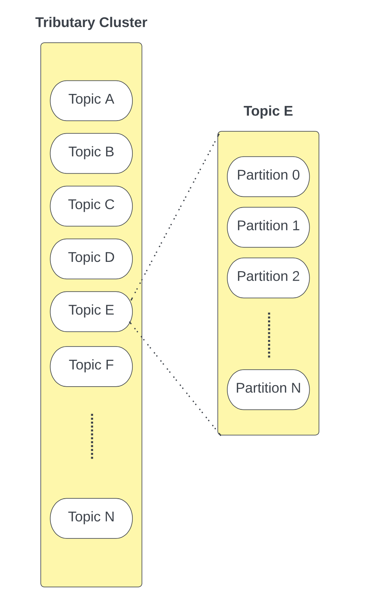
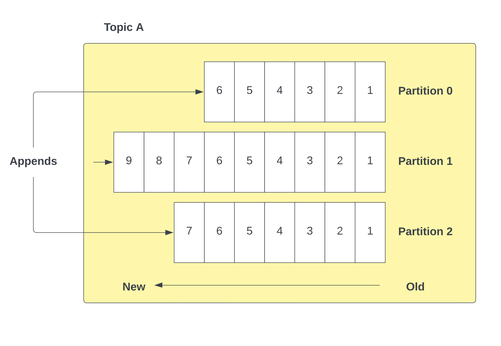
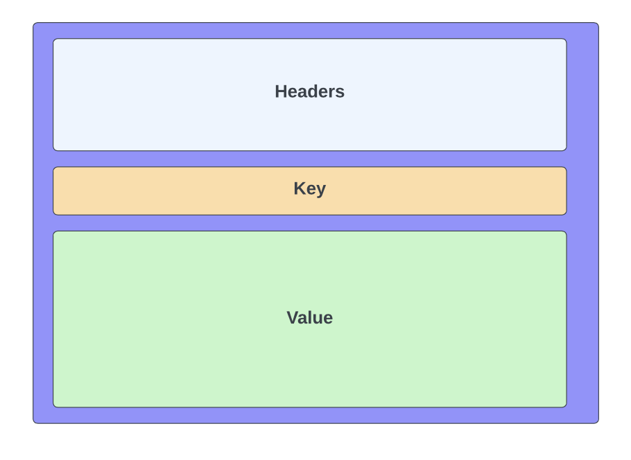
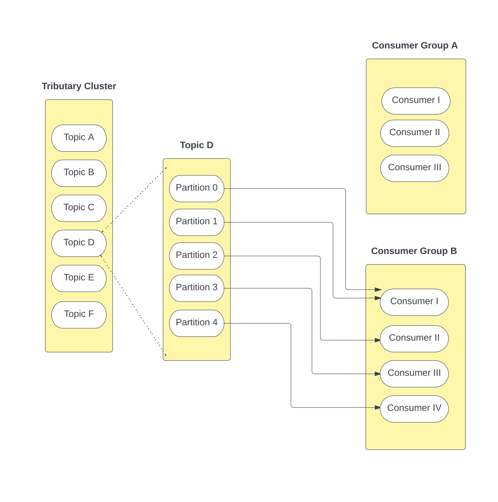
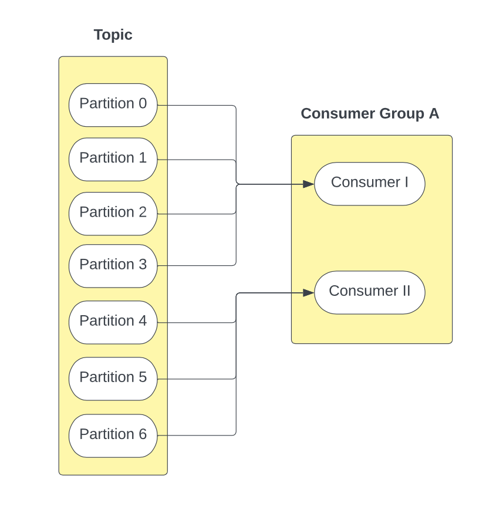
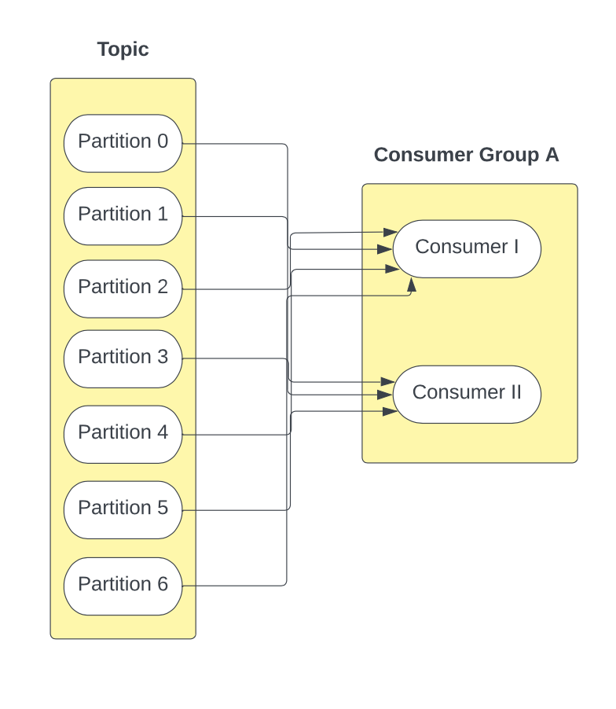

# 🌊 Assignment III: Tributary <!-- omit in toc -->

## Due Week 10 Friday, 5pm [Sydney Local Time](https://www.timeanddate.com/worldclock/australia/sydney) <!-- omit in toc -->

**No late penalty will be applied until Week 11 Tuesday, 5pm.**

> If you submit Week 11 Tuesday 4:59pm, you will not receive a late penalty.
>
> If you submit Week 11 Wednesday 5pm, you will recieve a late penalty of 5% where your maximum mark is now 95%.
>
> If you submit Week 11 Friday 5:01pm, you will recieve 0 regardless of ELP or Special Consideration.

## Important Notes <!-- omit in toc -->

- To receive a mark, you must **finish Task 2 at a minimum**. See [this](#511-task-1-preliminary-design-5-marks-🏛️).
  - Your video for Task 2 has to be **publicly viewable and linked in your blog post**.
- Late penalty is calculated per hour off your maximum assessment mark. See [this](#54-late-penalties) for more details
- There will be no "Short Extensions" from Special Consideration for this assignment.
- Submission must be pushed/merged onto the `main` branch on GitLab.
- **Any submissions after **Friday, Week 11 at 5pm** will be awarded 0 marks.** See [this](#54-late-penalties).

---

- [1. Getting Setup](#1-getting-setup)
- [2. Overview](#2-overview)
  - [2.1. Introduction Video](#21-introduction-video)
- [3. Engineering Requirements](#3-engineering-requirements)
  - [3.1. Message Lifecycle: A Simple Example](#31-message-lifecycle-a-simple-example)
  - [3.2. Message Structure](#32-message-structure)
  - [3.3. Producers](#33-producers)
    - [3.3.1. Allocation of Messages to Partitions](#331-allocation-of-messages-to-partitions)
  - [3.4. Consumer and Consumer Groups](#34-consumer-and-consumer-groups)
    - [3.4.1. Consumers](#341-consumers)
    - [3.4.2. Consumer Groups](#342-consumer-groups)
    - [3.4.3. Consumer Rebalancing](#343-consumer-rebalancing)
      - [3.4.3.1. Range Rebalancing](#3431-range-rebalancing)
      - [3.4.3.2. Round Robin Rebalancing](#3432-round-robin-rebalancing)
  - [3.5. Replay Messages](#35-replay-messages)
  - [3.6. Design Considerations](#36-design-considerations)
- [4. Interface](#4-interface)
  - [4.1. Java API](#41-java-api)
  - [4.2. Philosophy and Usage](#42-philosophy-and-usage)
  - [4.3. Command Line Interface](#43-command-line-interface)
- [5. Assessment](#5-assessment)
  - [5.1. Tasks](#51-tasks)
    - [5.1.1. Task 1) Preliminary Design (5 marks) 🏛️](#511-task-1-preliminary-design-5-marks-️)
  - [5.2. Task 2) Tributary Implementation (20 marks) 🔗](#52-task-2-tributary-implementation-20-marks-)
    - [5.2.1. Task 3) Final Design (15 marks) 🏢](#521-task-3-final-design-15-marks-)
  - [5.3. Submission](#53-submission)
  - [5.4. Late Penalties](#54-late-penalties)
  - [5.5. Extenuating Circumstances](#55-extenuating-circumstances)
  - [5.6. Other Expectations](#56-other-expectations)
  - [5.7. Plagiarism](#57-plagiarism)
- [6. Credits](#6-credits)

## Value 8% - Bonus <!-- omit in toc -->

This assignment can be used to make up lost marks in other assignments. It does not make up for marks lost in labs or the final exam.

> ❓ What is this assignment aiming to achieve?
>
> Having completed Assignments I and II, and gained familiarity and experience with course concepts, it’s time to turn this into expertise. This assignment aims to get you working on an important problem in modern software architecture - event-streaming and event pipelines.
>
> Since this is a bonus assignment, its completion is not required to get 100% in the course. That said, the assignment aims to provide high-achieving students with an opportunity to practice with the following 4 points:
>
> 1. **Synthesising Complex and Abstract Requirements**. This problem is a bit different from those you’ve encountered before, and may be difficult to understand at first. However, once you understand what you’re working with, the solution is more straightforward than coming to your initial understanding.
> 2. **Building a Java API**. Using your skills in Design by Contract, you’ll need to design a library that could be used to build event-driven systems.
> 3. **Design and Testing Methodologies**. You’ll be completing a preliminary design to set the trajectory before diving in, and iterating on your design as you go. You’ll also be planning out and writing a test suite for the system.
> 4. **Event-Driven & Asynchronous Design**. In developing this system, you’ll learn about how event streaming works and how event-driven design can be used in software systems. You’ll also need to consider the implications of working asynchronously, and how to manage concurrency issues.

# 1. Getting Setup

> This assignment can be completed in **pairs** or **individually**. You will be marked differently depending on whether you complete the assignment as a pair or individually. You can continue with the same pair as you had in Assignment II, or form a new pair if you like.

Please notify your tutor of your preference to work in a pair or individually by **Week 10 Monday**. You will not be able to change preferences after this date.

# 2. Overview

Event-Driven Architecture makes up much of the backbone of modern software. With a move towards decentralised microservice systems, there is a need for scalable asynchronous communication between software components.

In this assignment you will use principles discussed in lectures to **write a Java API** that another engineer could use to build an event-driven system.

This library is based on a heavily simplified version of the event streaming infrastructure [Apache Kafka](https://kafka.apache.org/), which you can read more about for your own interest. No understanding of Kafka is required to complete this assignment

## 2.1. Introduction Video

[COMP2511 Assignment III: Tributary](https://youtu.be/zq4ZfeMV-YU)

> NOTE: This video makes references to an older version of the spec, but the core concepts are the same.

# 3. Engineering Requirements

The fundamental premise on which Event-Driven Architecture rests is the ability of producer and consumer entities in the system to share data asynchronously via a stream-like channel.

However, our library will allow for more complex interactions than simply that of a single channel.

A **Tributary Cluster** contains a series of **topics**. A topic contains events which are logically grouped together. For example, a cluster could contain two topics: one for images-related events and one for video-related events. You can think of them like a table in a database or a folder in a file system.

Within each topic, there are a series of partitions - each partition is a queue where new messages are appended at the end of the partition.

A unit of data within a Tributary is a **message**, or record or event. For example, to update their profile a user may send a message to Partition 1 in Topic A, and this message will be appended to Partition 1 in Topic A. Each message has an optional key to indicate which partition it should be appended to.

A topic can be related to “user profiles” and each message relates to requesting an update to a specific profile. However, considering there can be many such requests at a given time, the system divides the incoming requests into multiple partitions. There can be multiple **consumers** consuming messages at the same time (concurrently). However, each partition is handled by only one consumer. Multiple consumers will allow us to effectively utilise the underlying hardware with multiple cores.

In the context of the library you are building, topics are parameterised on a generic type; all event payloads within that topic must be of the specified type.

## 3.1. Message Lifecycle: A Simple Example

Let us take the example of a user updating their profile. This results in an event being generated by the **producer** for a topic “user profiles” with the updated profile information. This event is now delivered to the Tributary, which assigns the event to one of the partitions. The producer indicates whether the message is randomly allocated to a partition, or provides a key specifying which partition to append the message to.

A consumer processes one or more partitions by sequentially processing (consuming) events in the allocated partitions.

## 3.2. Message Structure

Below is an example of a message structure that you could implement. You are free to add/remove fields as you see fit as long as the base requirements are still met.

- Headers
  - Datetime created;
  - ID;
  - Payload type;
- Key; and
- Value. The value is an object containing relevant information for a topic. Considering information required for different topics may change, you should consider using a generic type here.

## 3.3. Producers

A Producer is responsible for sending messages to the Tributary system. As shown in the diagram above, a message contains a header, an optional key, and value. Messages may have a key which indicates the specific partition
to send the message to. Alternatively, the partition the message should be sent to may be directly given to the producer by the system.

### 3.3.1. Allocation of Messages to Partitions

Producers can indicate whether to send a message to a particular partition by providing the corresponding partition key or requesting random allocation. There are two types of producers:

- **Random Producers** - the producer requests the Tributary system to randomly assign a message to a partition
- **Manual Producers** - the producer requests the Tributary system to assign a message to a particular partition by providing its corresponding key.

Once a producer has been created with one of the two above message allocation methods, it cannot change its message allocation method. Your implementation should allow for producers to be created with new message allocation methods added in the future.

## 3.4. Consumer and Consumer Groups

### 3.4.1. Consumers

Consumers are responsible for consuming (processing) messages stored in partition queues. A consumer consumes messages from a partition in the order that they were produced, and keeps track of the messages that have been consumed. Consumers operate as part of a consumer group. Each partition can be consumed by only one consumer per consumer group. Consumers can consume from more than one partition within a consumer group. 

### 3.4.2. Consumer Groups

A consumer group consists of one or more consumers, that are together capable of consuming from all the partitions in a topic.

Each topic can have multiple consumer groups. While each consumer group assigned to the same topic may contain a different number of consumers, they will all consume from the same number of partitions, i.e. all the partitions in a topic will always be handled by any consumer group assigned to the topic.

When a new consumer group is created, the consumers in the group begin their consumption from the **first unconsumed message** in all of the topics partitions they are assigned to. In other words, all consumers that share a partition consume messages parallel to each other, so that each message is only consumed once (except in controlled replays).

For example, in the image below Topic D is consumed by Consumer Group A, which has its 3 consumers assigned to the 5 partitions. Topic D is also consumed by Consumer Group B, which has its 4 consumers assigned to the 5 partitions.

### 3.4.3. Consumer Rebalancing

A system should be able to dynamically change the rebalancing strategy between one of two rebalancing strategies - range rebalancing, and round robin rebalancing. These rebalancing strategies are used to reassign partitions to consumers anytime a consumer is added to a consumer group or an existing consumer is removed from a consumer group.

If a partition is assigned a new consumer after rebalancing, the new consumer should continue consumption from where the previous consumer left off.

#### 3.4.3.1. Range Rebalancing

**Range** - The partitions are divided up evenly and allocated to the consumers. If there is an odd number of partitions, the first consumer takes one extra.

In the above example, Partitions 0, 1, 2, 3 are allocated to Consumer I and Partitions 4, 5 and 6 are allocated to Consumer II.

#### 3.4.3.2. Round Robin Rebalancing

**Round Robin** - In a round robin fashion, the partitions are allocated like cards being dealt out, where consumers take turns being allocated the next partition.

In the above example, Partitions 0, 2, 4 and 6 are allocated to Consumer I, and Partitions 1, 3 and 5 are allocated to Consumer II.

## 3.5. Replay Messages

One of the most powerful aspects of event streaming is the ability to **replay** messages that are stored in the queue. The way this can occur is via a **controlled replay**, which is done from a message offset in a partition. Messages from that point onwards are streamed through the pipeline, until the most recent message at the latest offset is reached.

> ℹ  NOTE: The above image demonstrates a consumer starting at offset 6 that performed normal consumption until offset 9. This consumer then triggered a
> controlled replay from offset 4 that played back all the messages from that offset until the most recently consumed message (i.e messages 6, 7, 8 and 9
> were consumed again).

## 3.6. Design Considerations

Two design considerations you will need to think about in your solution are as follows:

- **Concurrency** - since Producers and Consumers are all running in parallel, operating on a shared resource, how will you ensure correctness?
- **Generics** - How will you ensure that an object of any type can be used as an event payload in a tributary topic?

One of the key aims of this assignment is to get accustomed with concurrency in Java using the synchronized keyword as shown in lectures. As such
**we will not be permitting the use of any existing synchronization and concurrency libraries** as you must implement thread-safety yourselves.
This includes but is not limited to:

- The entire `java.util.concurrent` package
  - This includes any classes or interfaces that require this import namely thread-safe objects (eg `AtomicInteger`) or concurrency primitives (eg semaphores).
- Any other thread-safe classes such as `StringBuffer`

# 4. Interface

## 4.1. Java API

Since you are building a library on which other engineers can develop event-driven systems, you will need to have some classes which are available for others to use in their implementations - just as you do when you import any Java library.

You will need to determine which classes are part of the interface (API which other developers can use), and these classes will need to be documented with JavaDoc and go inside a folder called `api`. All other classes are considered part of the internal workings of the system (black box) and do not need JavaDoc. These classes should go inside a folder called `core`.

## 4.2. Philosophy and Usage

The way we refer to API here is a little bit different to how you might be used to it from previous courses. In something like COMP1531, the term “API” usually refers to a web-based service that you can call upon via an endpoint, to perform some of the work required by your application. In that scenario, components that make up the API are abstracted away from your application.

However, when we refer to an API here, we are describing more a library rather than a service. By using this library, we can construct various different domain specific applications by bringing together the components provided by the library. The Command Line Interface application described below is one specific instance of a domain-specific application that we are using our library to build, but it is not the behaviour of the API in itself. That is to say, the functionality that we want from the CLI isn’t abstracted behind the API as a service that facilitates requests based on user input, but rather we use the components provided by the library and coordinate them for this specific use case.

We should be able to take this library and create some other domain specific application that isn’t tied to this specific Command Line Interface program. Additionally, the components provided by your library like the producer and the consumer should be able to be extended by the user of your library to define new types of producers and consumers for their specific application, building upon the mechanisms and functionality provided by your library.

Although the library exposes a bunch of components publicly (the stuff that goes in `api` folder), there will also be things that the library uses internally that isn’t exposed to the user (the stuff that goes in the `core` folder). Hence the user only interacts with the public API of the library and uses the library and its components in the way the API defines.

You can think of all of this very similarly to the Java API. It is a library that provides a bunch of components that we can use to build our applications. The components that are available and the way we are able to use them are defined by the public API. We can also extend things provided by the library. For example, if I really wanted to, I could extend the `ArrayList` class, or maybe more practically, I can implement provided interfaces in my own custom components.

## 4.3. Command Line Interface

In order to run usability tests on your solution you will need to develop a way to interact with tributaries, producers, and consumers via a command line interface.

To do so, you should write a wrapper class called `TributaryCLI` that allows the user to input commands that create, modify, and interact with a tributary cluster system. This class should be in a separate package to the `api/core` packages of your library, as it shouldn't be a part of your library that other engineers developing their own event-driven systems would use.

As an **example** of what commands your CLI may provide, the following table has CRUD operations that you can implement - you can add/modify/remove CRUD operations as you see fit. If you choose to implement the table as is, note that you are free to modify the naming/syntax/output of commands. **The only requirement for the CLI is that you can use it to showcase an implementation of the [Engineering Requirements](#3-engineering-requirements) discussed in Section 3** - again, the table is only a guide.

<table>
  <tr>
    <th><b>Command</b></th>
    <th><b>Description</b></th>
    <th><b>Output</b></th>
  </tr>
  <tr>
    <td><code>create topic &lt;id&gt; &lt;type&gt;</code></td>
    <td>
      <ul>
        <li>Creates a new topic in the tributary.</li>
        <li><code>id</code> is the topic’s identifier.</li>
        <li>
          <code>type</code> is the type of event that goes through the topic.
          While this can be any type in Java, for the purposes of the CLI it can
          either be <code>Integer</code> or <code>String</code>.
        </li>
      </ul>
    </td>
    <td>
      A message showing the id, type and other relevant information about the
      topic confirming its creation.
    </td>
  </tr>
  <tr>
    <td><code>create partition &lt;topic&gt; &lt;id&gt;</code></td>
    <td>
      <ul>
        <li>
          Creates a new partition in the topic with id <code>topic</code>.
        </li>
        <li><code>id</code> is the partition’s identifier.</li>
      </ul>
    </td>
    <td>A message confirming the partition’s creation.</td>
  </tr>
  <tr>
    <td>
      <code>create consumer group &lt;id&gt; &lt;topic&gt; &lt;rebalancing&gt;</code>
    </td>
    <td>
      <ul>
        <li>Creates a new consumer group with the given identifier.</li>
        <li>
          <code>topic</code> is the topic the consumer group is subscribed to.
        </li>
        <li>
          <code>rebalancing</code> is the consumer group’s initial rebalancing
          method, one of <code>Range</code> or <code>RoundRobin</code>.
        </li>
      </ul>
    </td>
    <td>A message confirming the consumer group’s creation.</td>
  </tr>
  <tr>
    <td><code>create consumer &lt;group&gt; &lt;id&gt;</code></td>
    <td>
      <ul>
        <li>Creates a new consumer within a consumer group.</li>
      </ul>
    </td>
    <td>A message confirming the consumer’s creation.</td>
  </tr>
  <tr>
    <td><code>delete consumer &lt;consumer&gt;</code></td>
    <td>
      <ul>
        <li>Deletes the consumer with the given id.</li>
      </ul>
    </td>
    <td>
      A message confirming the consumer’s deletion, and an output of the
      rebalanced consumer group that the consumer was previously in.
    </td>
  </tr>
  <tr>
    <td>
      <code>create producer &lt;id&gt; &lt;type&gt; &lt;allocation&gt;</code>
    </td>
    <td>
      <ul>
        <li>Creates a new producer which produces events of the given type.</li>
        <li>
          <code>allocation</code> is either <code>Random</code> or
          <code>Manual</code>, determining which method of partition selection
          is used for publishing events.
        </li>
      </ul>
    </td>
    <td>A message confirming the producer’s creation.</td>
  </tr>
  <tr>
    <td>
      <code>produce event &lt;producer&gt; &lt;topic&gt; &lt;event&gt; &lt;partition&gt;</code>
    </td>
    <td>
      <ul>
        <li>
          Produces a new event from the given producer to the given topic.
        </li>
        <li>
          How you represent the event is up to you. We recommend using a JSON
          structure to represent the different parts of an event and the
          <code>event</code> parameter to this command is a filename to a JSON
          file with the event content inside.
        </li>
        <li>
          <code>partition</code> is an optional parameter used only if the
          producer publishes events to a manually specified partition which
          isn't stored inside the message structure
        </li>
      </ul>
    </td>
    <td>The event id, the id of the partition it is currently in.</td>
  </tr>
  <tr>
    <td><code>consume event &lt;consumer&gt; &lt;partition&gt;</code></td>
    <td>
      <ul>
        <li>
          The given consumer consumes an event from the given partition.
          Precondition: The consumer is already allocated to the given
          partition.
        </li>
      </ul>
    </td>
    <td>
      The id and contents of the event, showing that the consumer has received
      the event.
    </td>
  </tr>
  <tr>
    <td>
      <code>consume events &lt;consumer&gt; &lt;partition&gt; &lt;number of events&gt;</code>
    </td>
    <td>
      <ul>
        <li>Consumes multiple events from the given partition.</li>
      </ul>
    </td>
    <td>The id and contents of each event received in order.</td>
  </tr>
  <tr>
    <td><code>show topic &lt;topic&gt;</code></td>
    <td></td>
    <td>
      Prints a visual display of the given topic, including all partitions and
      all of the events currently in each partition.
    </td>
  </tr>
  <tr>
    <td><code>show consumer group &lt;group&gt;</code></td>
    <td></td>
    <td>
      Shows all consumers in the consumer group, and which partitions each
      consumer is receiving events from.
    </td>
  </tr>
  <tr>
    <td>
      <code>parallel produce (&lt;producer&gt;, &lt;topic&gt;, &lt;event&gt;), ...</code>
    </td>
    <td>
      <ul>
        <li>
          Produces a series of events in parallel. This is purely for
          demonstrating that your tributary can cope with multiple producers
          publishing events simultaneously.
        </li>
      </ul>
    </td>
    <td>For each event, the id of the partition it is currently in.</td>
  </tr>
  <tr>
    <td>
      <code> parallel consume (&lt;consumer&gt;, &lt;partition&gt;) </code>
    </td>
    <td>
      <ul>
        <li>
          Consumes a series of events in parallel. This is purely for
          demonstrating that your tributary can cope with multiple consumers
          receiving events simultaneously.
        </li>
      </ul>
    </td>
    <td>For each event consumed, the contents of the event and its id.</td>
  </tr>
  <tr>
    <td>
      <code>set consumer group rebalancing &lt;group&gt; &lt;rebalancing&gt;</code>
    </td>
    <td>
      <ul>
        <li>
          Updates the rebalancing method of consumer group <code>group</code> to
          be one of <code>Range</code> or <code>RoundRobin</code>.
        </li>
      </ul>
    </td>
    <td>A message confirming the new rebalancing method.</td>
  </tr>
  <tr>
    <td>
      <code>playback &lt;consumer&gt; &lt;partition&gt; &lt;offset&gt;</code>
    </td>
    <td>
      <ul>
        <li>Plays back events for a given consumer from the offset.</li>
      </ul>
    </td>
    <td>The id and contents of each event received in order.</td>
  </tr>
</table>

# 5. Assessment

In this assignment, you will need to design and implement the Tributary system outlined in the specification.

## 5.1. Tasks

### 5.1.1. Task 1) Preliminary Design (5 marks) 🏛️

Before you begin work you will need to complete a preliminary, high-level design up front. In a blog post, write an engineering specification which includes:

- An analysis of the engineering requirements;
- A list of **usability tests** - a “checklist” of scenarios which someone testing your system via the command line interface could use to verify that your system works according to the requirements.
- An **initial UML diagram** showing the entities, relationships between entities and key methods/fields in each entity (does not have to be a complete list, it just needs to be a first-version API)
- Your design for a **Java API** by which someone could use your solution to setup an event-driven system.
- A **testing plan** which explains how you are going to structure your tests for the system. You will need a mix of unit tests on individual components as well as integration tests to check that components work together. Your usability tests will need to be incorporated into this plan as well.

When it comes to implementation, there are two ways you can go about implementing a solution:

- **Feature-driven** - essentially, working through the table in Section 3.2 and getting one section working at a time. This approach is easier to usability test incrementally, harder to incorporate with multiple people, and can result in less cohesive software design and test design (more of an Incremental Design Approach)
- **Component-driven** - creating each component and writing unit tests individually, before bringing the pieces together and usability testing at the end. This approach is harder to usability test incrementally, easier to incorporate with multiple people but can result in more cohesive software and test design (more of a Big Design Up Front Approach)

You will need to pick one approach and justify your decision.

All of this should occur in a blog post before you start coding. You’ll be able to iterate on the design as you go, this is just the preliminary design.

> **No marks will be awarded for a preliminary design with no implementation.**

## 5.2. Task 2) Tributary Implementation (20 marks) 🔗

Implement the system according to the engineering requirements, using your chosen approach.

To demonstrate the **correctness** of your solution, **you will need to record a short video** of you walking through each scenario on your usability test “checklist” and showing that your solution satisfies the each test.

> - The purpose of the video is to walk through each scenario on your usability test "checklist" using your CLI - you **do not** need to walk through the code, nor show JUnit tests running;
> - Your video should be 5 minute or less. Videos longer than 5 minutes won’t be marked;
> - Any CLI text/output should be clearly legible - do not upload a low resolution video;
> - Upload your video to Google Drive or YouTube as an unlisted video (it **must be publicly viewable**) and link in your blog to submit.

To make your video demonstration clearer, you can:

- Index the video for specific features;
- Write out all the commands you plan to use beforehand, and copy them into the CLI to be run.

The breakdown of marks in this section is as follows.

<table>
  <tr>
    <th><b>Criterion</b></th>
    <th><b>Requirements</b></th>
  </tr>
  <tr>
    <td>Pass (8 marks pair, 10 marks solo)</td>
    <td>
      The system functions with a single producer, a single topic, a single
      partition, a single consumer group and a single consumer such that a
      message lifecycle can be completed. Events only have to be of a single
      type for a pass.
    </td>
  </tr>
  <tr>
    <td>Credit (12 marks pair, 15 marks solo)</td>
    <td>
      All requirements for a pass, as well as support for multiple types of
      events and demonstration of producers and consumers working in parallel.
    </td>
  </tr>
  <tr>
    <td>Distinction (16 marks pair, 20 marks solo)</td>
    <td>
      All requirements for a credit, as well as implementation of consumer
      groups with no rebalancing, implementation of producer message allocation
      options.
    </td>
  </tr>
  <tr>
    <td>High Distinction (20 marks pair)</td>
    <td>
      All requirements for a credit, as well as a full consumer rebalancing
      implementation and support for replaying of events.
    </td>
  </tr>
</table>

> When it comes to testing your solution, you will need to implement your testing plan.
>
> Your testing will be assessed in the final design task. You should aim for at least 80% coverage of your final solution as part of having good test design.

### 5.2.1. Task 3) Final Design (15 marks) 🏢

In a second blog post you will need to write in essence a report on your final solution. Your blog post will need to contain:

- Your final testing plan and your final list of usability tests;
- An overview of the Design Patterns used in your solution;
- Explanation of how you accommodated for the design considerations in your solution;
- Your final UML diagram; and
- A brief reflection on the assignment, including on the challenges you faced and whether you changed your development approach.

We will use this blog post and your code to assess the overall design of your solution.

## 5.3. Submission

We will take the contents of your `main` branch as your final submission. **Any commits that are made on `main` after the deadline will be counted as a late submission.**

Make sure you include your `design.pdf` and `blog.md` in your repository when you submit.

You may be asked to explain your code or design choices to a member of staff as part of your submission.

> **If your blog or video is not linked or visible in your repo when you submit, it will not be marked**. Markers will not be chasing up blog posts.

## 5.4. Late Penalties

For one week after the original due date, there is a late penalty of 5% per day off the **maximum assessment mark**. This is calculated per-hour to the next hour. For example, if you submit 25 hours late and would have received an on-time assessment mark of 100% your final assessment mark would be 94.79%.

Any submissions after **Friday, Week 11 at 5pm** will be awarded 0 marks.

## 5.5. Extenuating Circumstances

Extensions are only granted in extenuating circumstances and must be approved through either Special Consideration, which needs to be submitted prior to the assignment deadline, or pre-arranged through an Equitable Learning Plan with Equitable Learning Services and the Course Authority. In all cases please email [cs2511@cse.unsw.edu.au](mailto:cs2511@cse.unsw.edu.au).

Pairs where either student has Equitable Learning Provisions for group work are granted a 1-week extension by emailing [cs2511@cse.unsw.edu.au](mailto:cs2511@cse.unsw.edu.au).

If the student is completing the assignment individually and has an Equitable Learning Plan they can receive an extension of up to one week (no more).

Pairs where a students has received Special Consideration will give the pair an extension. Individuals completing the assignment who receive Special Consideration will be given an extension.

There is no subsequent late penalty on extended deadlines; any submissions made after Sunday Week 11, 5pm will be awarded 0 marks.

There will be no "Short Extensions" from Special Consideration for this assignment.

## 5.6. Other Expectations

The following segment applies to people completing the assignment in pairs.

While it is up to you as a pair to decide how work is distributed between you, for the purpose of assessment there are certain key criteria all partners must attain:

- Code contribution;
- Non-code contribution;
- Usage of Git/GitLab; and
- Academic conduct.

The details of each of these is below.

While, in general, both students will receive the same mark for the assignment, **if you as an individual fail to meet these criteria your final assignment mark will be reduced**.

> If you believe a your partner is not contributing as they should contribute, you must inform your tutor at the end of that corresponding week.

## 5.7. Plagiarism

The work you submit must be your own work. Submission of work partially or completely derived from any other person or jointly written with any other person is not permitted. The penalties for such an offence may include negative marks, automatic failure of the course and possibly other academic discipline. Assignment submissions will be examined both automatically and manually for such submissions.

The use of code synthesis tools, such as GitHub Copilot, is not permitted on this project.

Relevant scholarship authorities will be informed if students holding scholarships are involved in an incident of plagiarism or other misconduct.

Do not provide or show your project work to any other person, except for your group and the teaching staff of COMP2511. If you knowingly provide or show your assignment work to another person for any reason, and work derived from it is submitted you may be penalised, even if the work was submitted without your knowledge or consent. This may apply even if your work is submitted by a third party unknown to you.

Note, you will not be penalised if your work has the potential to be taken without your consent or knowledge.

# 6. Credits

Credit for the engineering requirements in this specification goes to Nine Technology Apache Kafka Training Course.
